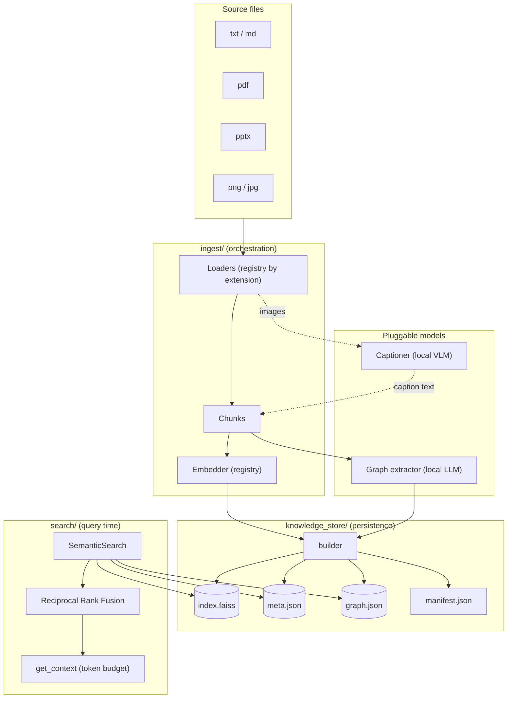
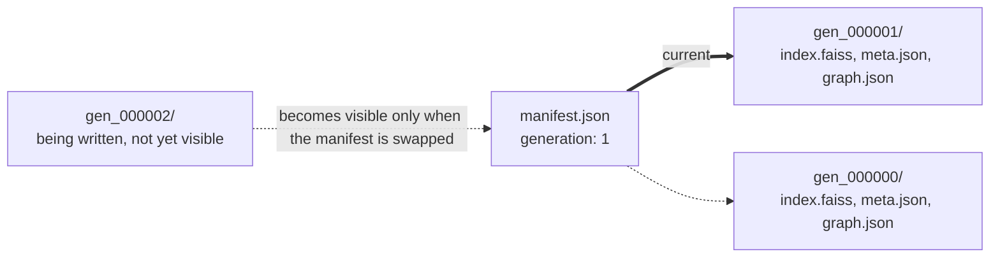
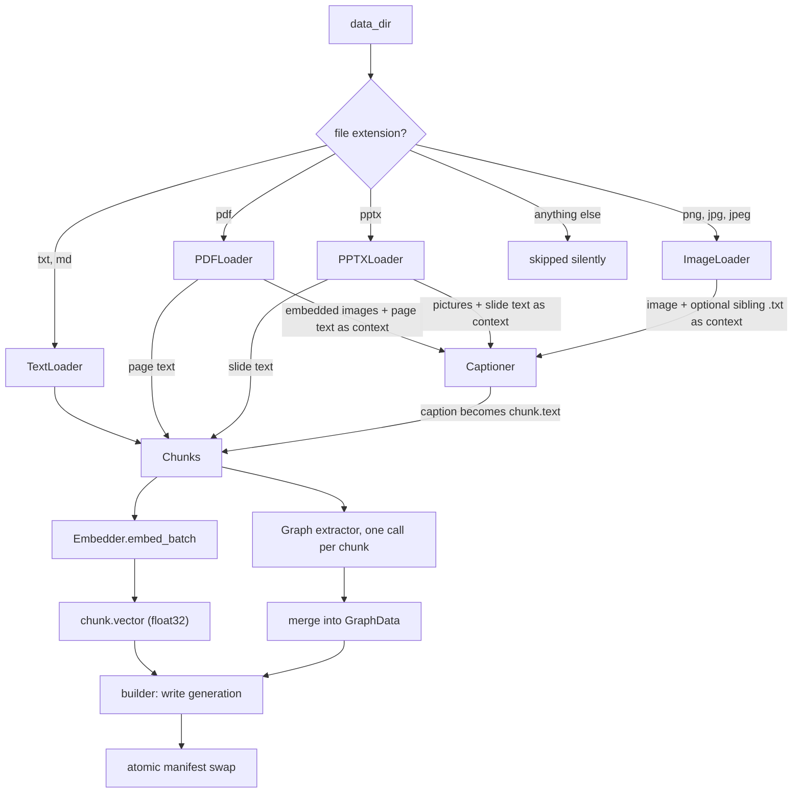
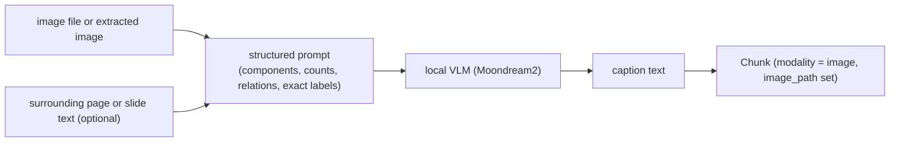
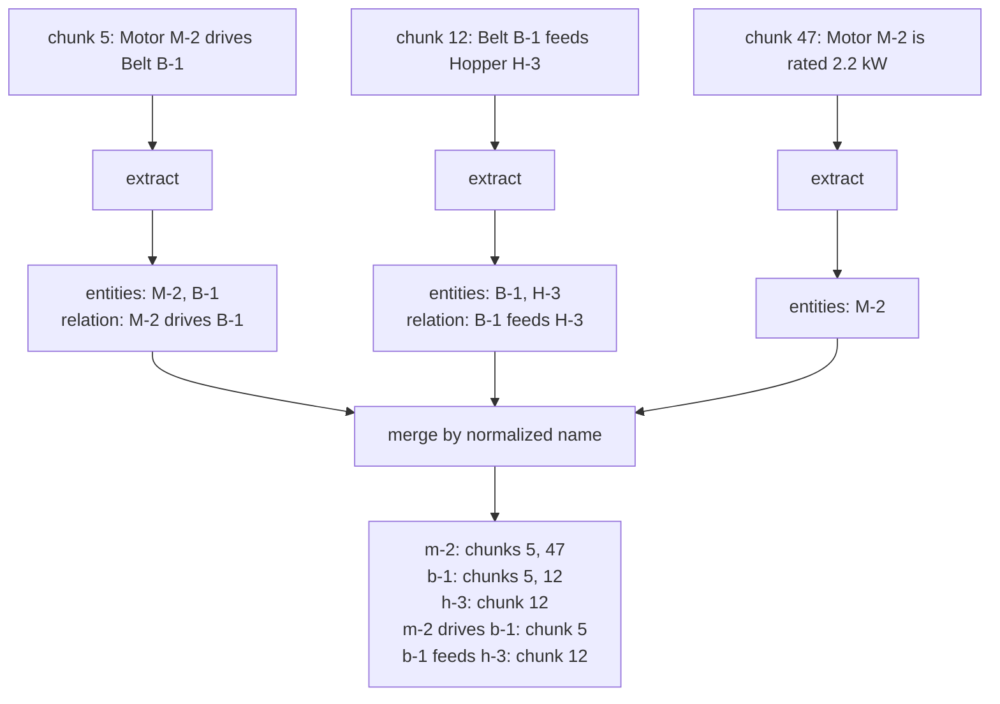
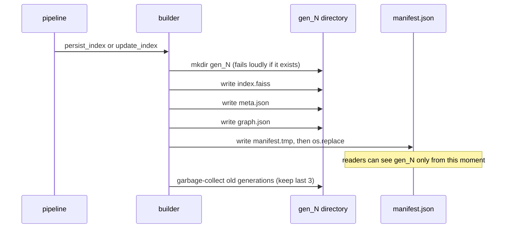
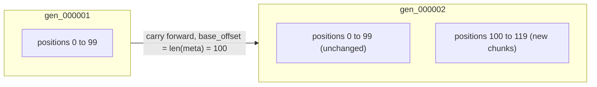
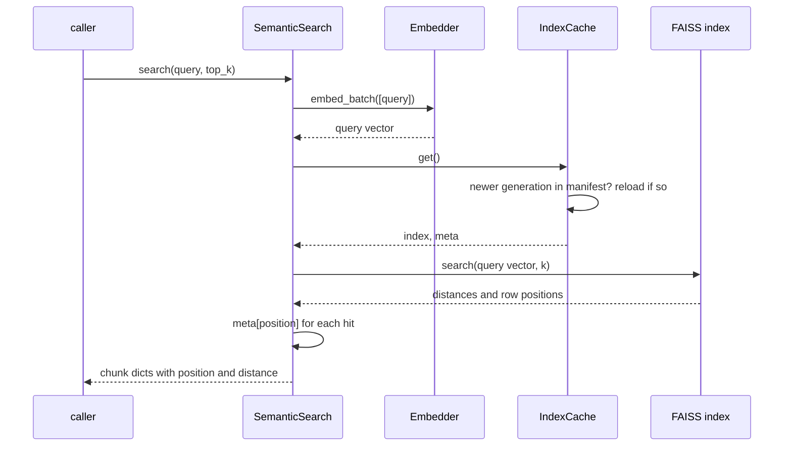
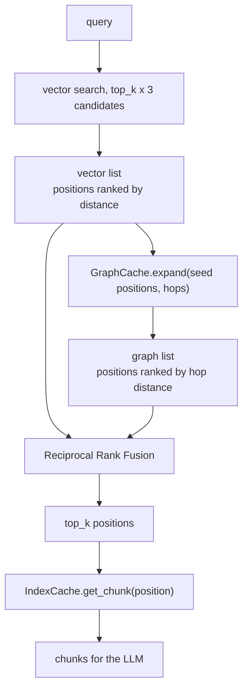
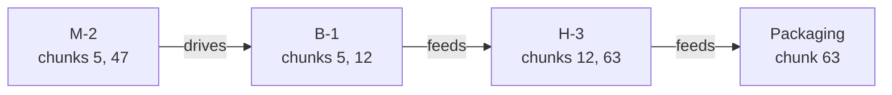

# RAG

Retrieval based on FAISS Indexes on Custom Embeddings.

Files supported as Input:
- Text files
- PDFs
- PPTs

Embeddings Supported:
- Sentence Transformer Embedding
- OpenAI embedding
- Add your own embedding (Currently by cloning and calling embedding.registry.register())

FAISS Indexed Vector DB store
- uses manhattan distance

APIs:
- POST /query
{
    "request": "user request text"
}

200 OK
{
    "results": [{
        "docId":
        "chunkId":
        "text":
        "distance":
    }]
}

500 Internal Server Error

Command Line:
python -m ingest.run_ingest <build/add> --data-dir <dir> --embedding <sentence_transformer/openai> --chunk-size <3>


------


# rRAG: Reusable RAG

A pluggable retrieval-augmented generation pipeline that ingests text, PDFs, PowerPoint decks, and diagrams, indexes them in two complementary stores (a FAISS vector index and a knowledge graph), and retrieves context for an LLM using plain vector search or hybrid vector + graph search.

Everything that varies is hidden behind a small abstract class and a registry: file formats (loaders), embedding models, image captioners, and graph extractors. Swapping one for another means writing one class and registering one name.

> **Status:** under active development. The text and vector-search path is the most exercised. The image-captioning and graph-extraction paths are newer and have had less validation against real documents.

## Contents

1. [Architecture at a glance](#1-architecture-at-a-glance)
2. [Project structure](#2-project-structure)
3. [Core concepts](#3-core-concepts)
4. [How indexing works](#4-how-indexing-works)
5. [How search works](#5-how-search-works)
6. [How hybrid search works](#6-how-hybrid-search-works)
7. [Building LLM context](#7-building-llm-context)
8. [Extending rRAG](#8-extending-rrag)
9. [Configuration and usage](#9-configuration-and-usage)
10. [Design decisions](#10-design-decisions)
11. [Known limitations and roadmap](#11-known-limitations-and-roadmap)
12. [Requirements](#12-requirements)

---

## 1. Architecture at a glance



**Dependency rule.** Low-level primitives (`loaders`, `embedding`, `captioning`, `knowledge_store`) never import from orchestration layers (`ingest`, `search`). The arrow only points down. Any circular import in this codebase traces back to that rule being broken somewhere.

---

## 2. Project structure

```
rRAG/
├── pyproject.toml
├── config.py                       # paths and default model names, one source of truth
│
├── embedding/
│   ├── __init__.py                 # AbstractEmbedding (embed, embed_batch, max_seq_length)
│   ├── registry.py
│   └── sentence_transformer.py
│
├── captioning/
│   ├── __init__.py                 # AbstractCaptioner (caption, caption_batch)
│   ├── registry.py
│   └── local_vlm_captioner.py      # Moondream2
│
├── loaders/
│   ├── __init__.py                 # AbstractLoader
│   ├── registry.py                 # extension -> loader, resolves captioner lazily
│   ├── text_utils.py               # split_into_chunks
│   ├── text_loader.py
│   ├── pdf_loader.py               # PyMuPDF: page text + embedded images
│   ├── pptx_loader.py              # python-pptx: slide text + pictures
│   └── image_loader.py             # standalone png / jpg
│
├── knowledge_store/
│   ├── chunk.py                    # Chunk dataclass
│   ├── tokens.py                   # count_tokens (tiktoken)
│   ├── manifest.py                 # read/write the "current generation" pointer
│   ├── paths.py                    # generation directory helpers and GC
│   ├── builder.py                  # persist_index / update_index (writes index + graph together)
│   ├── index_store/
│   │   └── cache.py                # IndexCache
│   └── graph_store/
│       ├── __init__.py             # AbstractGraphExtractor
│       ├── schema.py               # Entity, Relation, Stored*, GraphData
│       ├── dedup.py                # normalize_entity_id
│       ├── extractor.py            # OllamaGraphExtractor
│       ├── registry.py
│       └── store.py                # merge, load/save, GraphCache
│
├── ingest/
│   ├── utils.py                    # make_chunks_from_dir
│   ├── pipeline.py                 # data_pipeline, add_data
│   └── run_ingest.py               # CLI
│
├── search/
│   ├── rrf.py                      # reciprocal_rank_fusion
│   └── semantic_search.py          # SemanticSearch
│
└── data/
    ├── raw/                        # your source documents
    ├── extracted_images/           # images pulled out of PDFs and decks
    └── index/
        ├── manifest.json
        ├── gen_000000/
        │   ├── index.faiss
        │   ├── meta.json
        │   └── graph.json
        └── gen_000001/ ...
```

> Named `knowledge_store/` rather than `vector_db/` because it holds two persisted stores — the FAISS vector index and the knowledge graph — not just vectors.

---

## 3. Core concepts

### Chunk

The unit that gets embedded, stored, and retrieved.

| Field | Meaning |
|---|---|
| `doc_id`, `chunk_id` | Human-readable origin (file stem, page and piece number). Used for citations, not for identity. |
| `text` | The text that gets embedded. For images this is the generated caption. |
| `vector` | `float32` numpy array, filled in by the embedder. |
| `modality` | `"text"` or `"image"`. |
| `source_path`, `page_num` | Where it came from. |
| `image_path` | Required when `modality == "image"`. Points at the extracted image on disk. |

### A chunk's identity is its position

FAISS returns integer row positions from `search()`, and `meta.json` is a list kept in exactly the same order as the vectors were added. So "chunk number 47" means row 47 of the FAISS index and element 47 of `meta.json`. The knowledge graph reuses the same integers as provenance: every entity and relation records which chunk positions it was extracted from.

This works because the store is append-only. Nothing is ever deleted or reordered, so position 47 stays position 47 across generations. If document deletion is ever added, that is the point where a position-independent id becomes necessary.

### Generations and the manifest

The index is never modified in place. Every write creates a new, self-contained generation directory and only then repoints a tiny manifest file at it.



Why this matters: the index, metadata, and graph are three files that must describe the same moment in time. If they were overwritten in place, a crash halfway through (or a reader loading mid-write) could pair a new index with old metadata, and retrieval would return subtly wrong results without raising any error. With immutable generations plus one atomic pointer swap, a reader either sees a complete generation or does not see it at all. A crash leaves behind an orphaned directory nobody points to, which is harmless.

---

## 4. How indexing works

### 4.1 Overview



### 4.2 Loading and chunking

Loaders are chosen by file extension through `loaders/registry.py`. Text is split by `split_into_chunks`, which groups newline-delimited units (default 6 per chunk) and also flushes early when a chunk would exceed `max_chars`.

`max_chars` exists because embedding models silently truncate input past their token limit (MiniLM-L6 attends to 256 tokens). A chunk that runs long would be stored in full but embedded from only its first part, so the tail could never match a query. The budget is derived from the embedder actually in use:

```
max_chars = embedder.max_seq_length * 4 chars/token * 0.9 safety margin
```

with a fallback of 1000 characters if the embedder does not report a limit. The value is computed once in `_prepare_chunks` from the embedder instance passed in, so the model that embeds and the model that sizes the chunks can never disagree.

Note that `chunk_size` counts newline-delimited units, not true sentences. For prose with real paragraph breaks that is usually what you want. PDF text extraction tends to break at visual line wraps, so chunk sizes there are less uniform.

### 4.3 Images and diagrams

Images cannot be embedded by a text embedder, so each one is converted to text first.



- The prompt asks for what the diagram depicts, component counts, how parts connect, and any visible labels transcribed exactly, and tells the model not to guess at values it cannot see.
- Surrounding manual text is passed as optional context. There is one code path: with context the caption is grounded, without it the model falls back to pure visual description.
- The caption is what gets embedded and searched. The original image path is kept on the chunk so the actual pixels can be shown or handed to a vision-capable LLM later.
- The captioner is resolved lazily. `get_loader` only loads the VLM the first time it meets a PDF, deck, or image, so ingesting a folder of plain text never pays the model-load cost.

### 4.4 Embedding

`embedder.embed_batch(texts)` is called once for all chunks. Batching happens inside each embedder implementation, because what "a batch" means differs by backend (local batch size versus an API's per-request limit). Vectors are converted to `float32` numpy arrays at the boundary, so everything downstream can rely on that shape.

### 4.5 Knowledge graph extraction

Every chunk, text or image, is passed to the graph extractor. The extractor is a local LLM constrained to a JSON schema, so its output is always structurally valid.



Key points:

- The model sees one chunk at a time and refers to entities by name. It never sees positions or ids.
- Our own code (`merge_extraction_into_graph`) normalizes each name (lowercase, collapsed whitespace) to form the node id, so "Motor M-2" and "motor m-2" become one node.
- Each stored entity and relation accumulates `source_chunks`, the list of chunk positions that mentioned it. This is provenance, and it deliberately spans chunks: the same entity mentioned in ten places becomes one node linked to ten chunks. That cross-chunk stitching is what makes multi-hop retrieval possible.
- The prompt explicitly allows empty output, so chunks with no components or relationships (a safety notice, a one-line instruction) yield nothing rather than invented structure.

### 4.6 Writing a generation



The manifest swap is always the last write and always atomic (`os.replace` on a temp file). Garbage collection runs after the swap and never deletes the generation the manifest points to.

### 4.7 Updating an existing index

`update_index` reads the current generation, appends the new chunks, and writes the result as a new generation. The old generation is never touched.



`base_offset = len(meta)` is captured before the new chunks are appended, so newly extracted graph entities get positions 100 and up rather than colliding with existing ones. The existing graph is loaded from the old generation and new extractions are merged into it before it is saved as `gen_000002/graph.json`.

### 4.8 How readers stay current

`IndexCache` and `GraphCache` each remember which generation they loaded. On every access they read the manifest (one tiny JSON file) and reload only if the generation number has advanced. A long-running app therefore picks up new ingestions without a restart.

---

## 5. How search works

Plain vector search finds the chunks whose meaning is closest to the query.



Each result is the chunk's `meta.json` entry (`doc_id`, `chunk_id`, `text`, `modality`, `image_path`) plus its `position` and `distance`. The index is `IndexFlatL2`, an exact brute-force scan: every query is compared against every stored vector. That is the right choice at personal-project scale and it implements the same interface as the approximate indexes (IVF, HNSW), so it can be swapped later if the corpus grows into the hundreds of thousands of vectors.

Vector search answers "find text about this topic." It scores every chunk independently and has no notion that one chunk is connected to another.

---

## 6. How hybrid search works

### 6.1 Where vector search alone falls short

- *"What does the manual say about lubricating the conveyor belt?"* One chunk holds the answer and its wording resembles the query. Vector search is the right tool and the graph adds nothing.
- *"What happens downstream if Motor M-2 fails?"* The answer is spread across several chunks: M-2 drives B-1 (one chunk), B-1 feeds H-3 (another, possibly on a different page), H-3 feeds packaging (a third). Those later chunks do not resemble the query text, so vector search will not rank them. Only the graph knows they are chained together.

Hybrid search runs both retrievers on every query and fuses the results, so you never have to decide up front which kind of question you are asking.

### 6.2 Flow



### 6.3 Graph expansion

`GraphCache.expand(seed_positions, hops)` turns vector hits into a ranked list of related chunks:

1. **Find seed entities.** Any graph node whose `source_chunks` includes one of the seed positions.
2. **Hop 0.** Emit every chunk that mentions a seed entity. This includes the seed chunks themselves plus other places those entities are mentioned.
3. **Hops 1 to N.** Walk to neighboring nodes (following edges in either direction), emit the chunks that mention them, and repeat.
4. Chunks are emitted once, in order of discovery, so the list is ranked by hop distance.

Worked example. The graph built from section 4.5 looks like this, with the chunks each node came from:



Query: *"what happens downstream if Motor M-2 fails?"* Suppose vector search surfaces chunks `[5, 20, 47, 33, 8]`.

- Seed entities: M-2 and B-1 (both appear in chunk 5).
- Hop 0: M-2 contributes 5 and 47, B-1 contributes 5 and 12, giving `[5, 47, 12]`.
- Hop 1: H-3 contributes 12 and 63, and 12 is already emitted, so it adds `[63]`.
- Graph list: `[5, 47, 12, 63]`.

Chunk 12 (B-1 feeds H-3) was not in the vector top 5. It surfaces only because the graph connects it to the seeds.

### 6.4 Reciprocal Rank Fusion

The two lists are merged by rank position only:

```
score(chunk) = sum over lists of  1 / (k + rank)        with k = 60 and rank starting at 1
```

A chunk near the top of both lists accumulates credit from each. A chunk in only one list still scores from that one. Continuing the example with `top_k = 4`:

| Chunk | Vector rank | Graph rank | Score |
|---|---|---|---|
| 5 | 1 | 1 | 0.03279 |
| 47 | 3 | 2 | 0.03200 |
| 20 | 2 | none | 0.01613 |
| 12 | none | 3 | 0.01587 |
| 33 | 4 | none | 0.01563 |
| 63 | none | 4 | 0.01563 |
| 8 | 5 | none | 0.01538 |

Final top 4: `5, 47, 20, 12`. Chunk 12 made it in through the graph alone. Chunk 63 (the packaging chunk, two edges away) narrowly missed. Raise `top_k` or lower the number of vector candidates if you want deeper chains to survive fusion.

**Why RRF instead of a weighted sum.** FAISS distances and graph hop counts live on unrelated numeric scales with no natural conversion between them. A weighted sum forces you to invent and tune a conversion factor. RRF uses only rank position, so it needs no calibration and extends to a third or fourth ranked list (for example lexical BM25) without changes.

**Graceful degradation.** If a seed chunk has no extracted entities, expansion contributes nothing for it and the result is just the vector ranking. No per-query mode switch is needed.

### 6.5 Tuning knobs

| Knob | Default | Effect |
|---|---|---|
| `top_k` | 5 | Chunks returned after fusion. |
| vector candidates | `top_k * 3` | How many vector hits seed the graph and enter fusion. |
| `graph_hops` | 2 | How far to walk from seed entities. More hops pull in more distant, less relevant chunks. |
| RRF `k` | 60 | Damping constant. Higher values flatten the difference between high and low ranks. |

---

## 7. Building LLM context

`SemanticSearch.get_context(query, top_k, max_tokens, use_graph)` retrieves chunks (hybrid by default, vector-only with `use_graph=False`) and packs them into one prompt-ready string:

```
[manual#p12_c0]
Increasing motor RPM increases conveyor speed. ...

[manual#p12_img0]
The diagram shows a conveyor with 3 motors driving 2 belts. ...
```

Chunks are added in ranked order until the token budget would be exceeded. Token counts use `tiktoken` (`cl100k_base`), which is an approximation for non-OpenAI models but close enough for budgeting. The header carries `doc_id#chunk_id` so answers can cite their sources.

Image chunks currently contribute their caption text. The retrieval side already carries `modality` and `image_path`, so a caller with a vision-capable LLM can attach the original image for any image chunk in the results.

---

## 8. Extending rRAG

Every extension point follows the same pattern: subclass the abstract class, then register a name.

| To add | Subclass | Register in | Selected by |
|---|---|---|---|
| A file format (docx, html, csv) | `loaders.AbstractLoader` | `loaders/registry.py` extension map | file extension |
| An embedding model | `embedding.AbstractEmbedding` | `embedding/registry.py` | `--embedding` / `config.EMBEDDING_MODEL` |
| A captioning backend (API VLM, larger local VLM) | `captioning.AbstractCaptioner` | `captioning/registry.py` | `--captioner` / `config.CAPTIONING_MODEL` |
| A graph extractor (API LLM) | `graph_store.AbstractGraphExtractor` | `graph_store/registry.py` | `--graph-backend` / `config.GRAPH_EXTRACTOR` |

Two design notes:

- There is one `ImageLoader`, not one per image format. Opening a png or a jpg is the same work; the real axis of variation (which model describes the image) is already the captioner. The exception would be vector formats like SVG, which need rasterizing first.
- Batching lives inside each embedder or captioner, not in the caller, because the right batching strategy is backend-specific.

---

## 9. Configuration and usage

### config.py

```python
DATA_DIR         = Path(__file__).parent / "data"
INDEX_ROOT       = DATA_DIR / "index"
MANIFEST         = INDEX_ROOT / "manifest.json"

EMBEDDING_MODEL  = "sentence_transformer"   # embedding registry key
CAPTIONING_MODEL = "local_vlm"              # captioning registry key
GRAPH_EXTRACTOR  = "ollama"                 # graph extractor registry key
OLLAMA_MODEL     = "llama3.2"               # checkpoint the Ollama extractor uses
```

The registry key says which class handles the job. The `OLLAMA_MODEL` checkpoint says which model that class talks to. Check `ollama list` for what you actually have pulled.

### Build and update the index

Run from the project root (or `pip install -e .` so imports work from anywhere):

```bash
# first build (refuses to run if an index already exists)
python -m ingest.run_ingest build --data-dir data/raw

# append new documents as a new generation
python -m ingest.run_ingest add --data-dir data/raw/new_batch
```

Optional flags: `--embedding`, `--chunk-size`, `--captioner`, `--graph-backend`.

### Query from Python

```python
import config
from search.semantic_search import SemanticSearch

search = SemanticSearch(config.INDEX_ROOT, config.MANIFEST)

hits    = search.search("how do I make the belt run faster?", top_k=5)      # vector only
hybrid  = search.hybrid_search("what fails if motor M-2 stops?", top_k=5)   # vector + graph
context = search.get_context("what fails if motor M-2 stops?", max_tokens=2000)
```

---

## 10. Design decisions

Short versions of why things are the way they are.

- **Embedding and indexing are different jobs.** Embedding picks the representation (meaning as geometry). Indexing decides how to search it without comparing against everything. `IndexFlatL2` does no clever narrowing; it is called an index because it implements the shared add/search interface.
- **Why not index the raw text instead?** Keyword (inverted) indexes are fast and precise on exact terms but blind to paraphrase: "make the belt run faster" shares no words with "increasing motor RPM increases conveyor speed". Embeddings close that vocabulary gap. Each has a blind spot, which is why hybrid retrieval exists.
- **Caption and graph extraction are separate steps.** They need different skills (visual grounding versus strict schema discipline) and structuring too early can suppress the model's own reasoning about what it sees. The caption is the retrievable prose and the extractor's input; the graph is built from the text, not the pixels.
- **A GNN does not extract the graph.** A graph neural network learns from a graph that already exists. Turning text into entities and relations is a language task. A GNN's proper role is later, for link prediction or node embeddings on top of an extracted graph.
- **Graph in networkx plus JSON, not a graph database.** The graph is persisted in the same generation directory as the index, so the vector store and the graph can never drift out of sync. Embedded graph databases were considered, but the leading option was recently archived.
- **Position as identity, not UUIDs or hashes.** FAISS already returns positions and `meta.json` is aligned to them. A synthetic id would be a second identifier for a problem the first one already solves, at least while the store is append-only.
- **Two graph schemas.** `Entity`/`Relation` are what the LLM is asked to fill in, so they contain only what the model can know. `StoredEntity`/`StoredRelation` add canonical ids and provenance, which only our code knows.
- **Dependency direction points down only.** Loaders, embedders, captioners, and the store never import from `ingest` or `search`.

---

## 11. Known limitations and roadmap

**Limitations**

- **Entity resolution is name-normalization only.** "Motor M-2" and "motor m-2" merge; "the drive motor" and "M-2" do not. Embedding-similarity matching is the natural upgrade once real extractions show fragmentation.
- **Extraction runs on every chunk.** That is thousands of local LLM calls on a large corpus, so ingestion is slow. Batching or a cheap pre-filter for very short chunks are the first things to try.
- **Whole-file rewrites.** `meta.json` and `graph.json` are rewritten in full each generation. Fine at this scale; a real database would replace them if updates become the bottleneck.
- **No re-ingestion dedup.** Adding a file that is already indexed adds duplicate vectors. A file-level content hash (skip files already processed) is the planned fix, and it also avoids re-captioning and re-embedding.
- **Captions are not cached.** Re-processing an unchanged image calls the VLM again.
- **Embedding-model consistency is not enforced.** If an index is built with one model and queried with another that happens to share a dimension, results are silently wrong. Recording the model name in the manifest and checking it at load time would catch this.
- **Distance metric.** Vectors are not normalized and the index uses L2. Sentence-transformer models are generally tuned for cosine similarity, so normalizing embeddings (or using an inner-product index on normalized vectors) is worth deciding deliberately.
- **Relations can reference unlisted entities.** The extractor may name an entity in a relation without listing it in `entities`, leaving a dangling edge until a later chunk introduces it.
- **Rank within a graph hop is arbitrary** (set iteration order), so only the coarse hop ordering is meaningful.
- **Single-process assumption.** Reader-side locking is omitted on purpose. If ingestion and serving ever run as separate OS processes, add a writer file lock and a double-checked read in the cache.
- **Positions assume append-only storage.** Deleting documents would need stable ids.
- **Token budgeting is approximate** for non-OpenAI models.

**Roadmap ideas**

- Lexical BM25 index as a third ranked list in the same RRF fusion (exact part numbers and labels).
- Pass the original image, not just its caption, to a vision-capable generating LLM.
- API-backed captioner and graph extractor for higher-fidelity output.
- OCR pass appended to diagram captions for exact label recall.
- GNN link prediction over the extracted graph.
- CLIP-style visual embeddings if pure visual similarity search becomes a requirement.

---

## 12. Requirements

- Python 3.10+
- `faiss-cpu`, `numpy`, `pydantic`, `networkx`, `tiktoken`
- `sentence-transformers`, `torch`, `transformers`, `pillow`
- `pymupdf` (PDF), `python-pptx` (PowerPoint)
- `pyvips` and `pyvips-binary` (Moondream2 preprocessing; may need `brew install vips` on macOS)
- `ollama` Python client, plus the Ollama app running locally with a model pulled
- Optional: `filelock`, only if ingestion and serving become separate processes