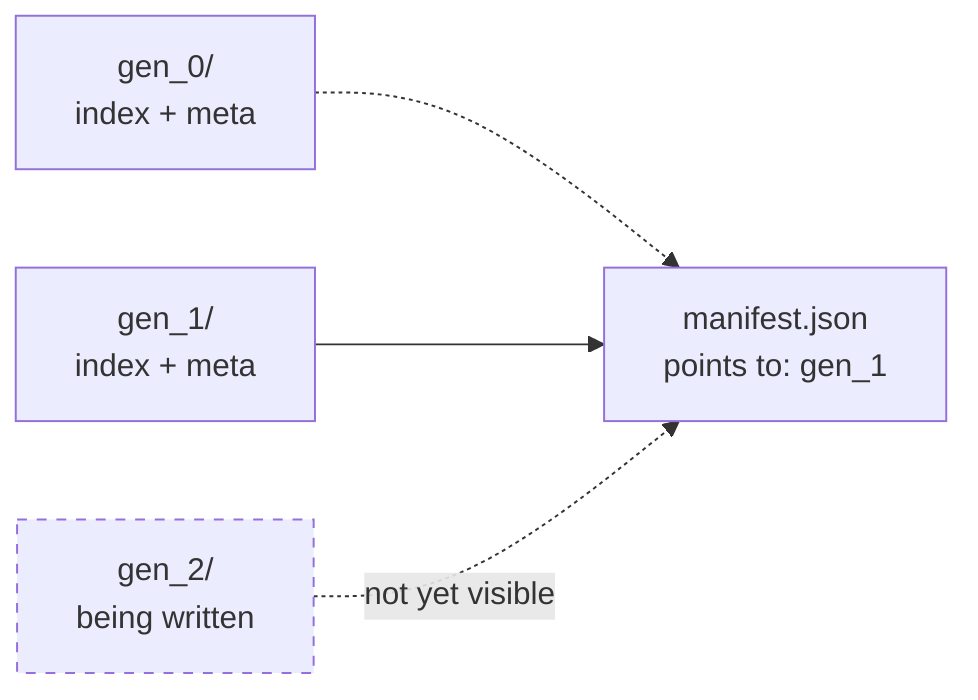
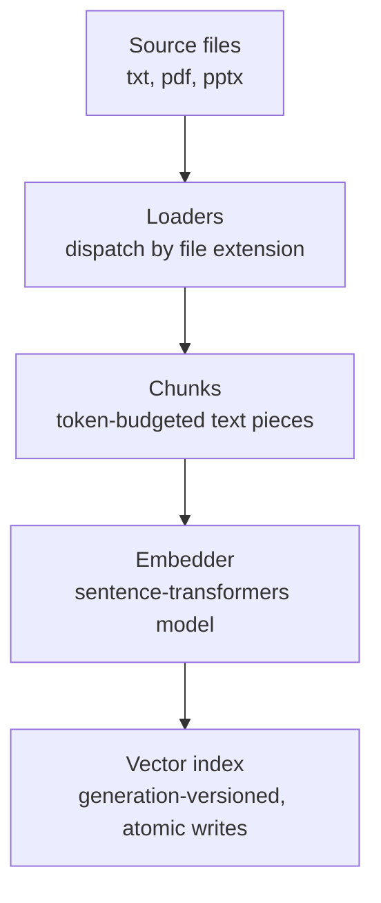
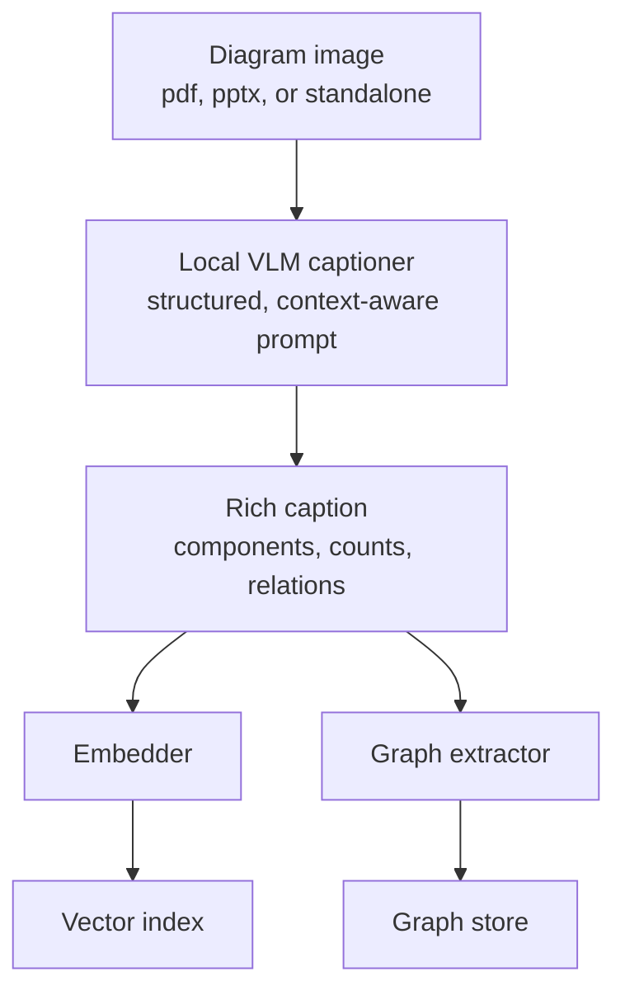
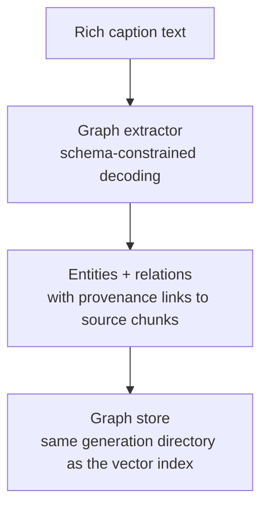
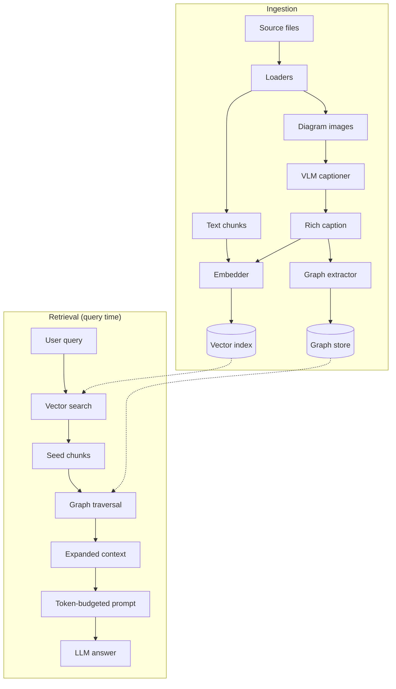

# rRAG — Architecture & Design Decisions

This document captures the *reasoning* behind rRAG's design — not the code, but why each piece exists, what alternatives were rejected, and why. It's meant to be read on its own, later, without the conversation that produced it — treat it as a design-review reference you can point to when a decision gets questioned (in an interview, a code review, or your own future self wondering "wait, why did I do it this way?").

## Table of Contents

1. [Why the Vector Store Needed More Care Than "Just Save a File"](#1-why-the-vector-store-needed-more-care-than-just-save-a-file)
2. [Project Structure & Naming Principles](#2-project-structure--naming-principles)
3. [The Text Ingestion Pipeline](#3-the-text-ingestion-pipeline)
4. [The Image & Diagram Pipeline](#4-the-image--diagram-pipeline)
5. [Knowledge Graph Extraction](#5-knowledge-graph-extraction)
6. [Why Embeddings *and* Indexing — Not Either/Or](#6-why-embeddings-and-indexing--not-eitheror)
7. [Why Not Just Index the Raw Text?](#7-why-not-just-index-the-raw-text)
8. [General Engineering Lessons From This Build](#8-general-engineering-lessons-from-this-build)
9. [Full Pipeline, End to End](#9-full-pipeline-end-to-end)

---

## 1. Why the Vector Store Needed More Care Than "Just Save a File"

### The problem: three files that must agree with each other

The vector index isn't one file — it's three: the FAISS index itself (vectors), the metadata (the text each vector represents), and a manifest (a pointer saying which version is current). A reader loading these needs all three to describe the *same* moment in time. The naive approach — read the index, then read the metadata, then check the manifest — has a gap: if a rebuild happens to land in the middle of that sequence, a reader can end up holding an index from one version paired with metadata from a *different* version, while believing (because it checked the manifest last) that everything is current and consistent.

This is dangerous specifically because it fails silently. Retrieval doesn't crash — it just quietly returns results that are subtly wrong, shifted, or mismatched, and there's no error to point you at the cause. This class of bug (multiple independent stores that must logically agree, updated separately) is one of the most common sources of "works most of the time, mysteriously wrong occasionally" bugs in any system with more than one persisted file describing the same data.

### The permanent version of the same problem: writers

The reader-side issue above is a *race* — bad only if a read and a write happen to overlap. There's a worse version on the writer side: if an update process writes the new index file in place, then crashes before it finishes writing the new metadata file, the mismatch isn't transient — it's now permanently on disk. Worse still, the *next* update run will read that already-corrupted file as its starting point, compounding the damage (for example, silently duplicating vectors that were partially re-added).

### The fix: immutable generations, one atomic pointer

The solution that actually closes this off: never overwrite a version in place. Every update writes an entirely new, self-contained "generation" — its own directory holding a complete, consistent index + metadata pair — and never touches any earlier generation again. A single small manifest file records which generation is "current," and that manifest is the *only* thing ever updated in place, always as the very last step of a write, and always atomically (write to a temporary file, then rename it into place — an operation the operating system guarantees either fully happens or fully doesn't, with no half-done state visible to anyone else).

The result: a reader either sees a generation that is 100% complete, or doesn't know that generation exists yet. There's no in-between state to accidentally observe. A crash mid-write just leaves behind an orphaned directory nobody points to — harmless, cleanable later, never corrupting.

### Does this matter if it's all just one process?

Partially. If ingestion and query-serving are strictly sequential calls in a single thread — never running at the same time — the *reader-side* protections (locks, double-checked reads) become unnecessary, because nothing can interrupt a read halfway through. But the *atomic-write* discipline matters regardless of threading, because a crash (a killed process, a power loss, an unhandled exception) can happen to a single-threaded program just as easily as a multi-threaded one, and that's what atomic writes protect against — not races, but partial writes.

The other thing worth being deliberate about: "one application" quietly turns into two operating-system processes more often than expected — a scheduled ingestion script plus a long-running server process is *two processes*, even if you think of it as "one app." Worth explicitly confirming which situation actually applies rather than assuming.

*The manifest is the single source of truth for "current." Old generations are left alone; a new generation only becomes visible the instant the manifest is atomically repointed to it.*

---

## 2. Project Structure & Naming Principles

A few conventions that made the codebase easier to reason about as it grew, worth carrying into future projects:

- **Name files by role, not by the library implementing them.** A file that builds the index shouldn't be named after the library it happens to use — if that library ever changes, the filename becomes a lie. Name it after what it *does*.
- **Avoid `utils.py` / `helpers.py` as destinations.** These become dumping grounds that accumulate unrelated logic over time. If a function needs a home, name the file after the specific job it does — it makes the codebase searchable by intent, not by "I wasn't sure where this goes."
- **Centralize configuration in one place.** Scattered path/constant literals across multiple entrypoints inevitably drift out of sync; one config module that everything else imports from means there's exactly one place to change when something moves.
- **Dependency direction should only ever point one way.** Low-level, reusable pieces (loaders, embedders, the vector store) should never import from the higher-level orchestration code that assembles them (the ingestion pipeline, the serving app). When a "low-level" module needs something from a "higher" one, that's usually a sign the shared thing actually belongs at the lower level and should move there. Violating this is what causes circular-import errors — Python trying to finish loading module A, which needs module B, which needs something from module A that hasn't been defined yet.
- **One class per concern doesn't necessarily mean one abstraction per concern.** A registry-and-abstract-base pattern is worth introducing when there's *genuine* behavioral variation to plug into (different file formats need genuinely different parsing logic; different captioning backends need genuinely different model-calling logic). It's *not* worth introducing when the variation you're anticipating is actually handled by an abstraction one layer down already — more on this in Section 4.

---

## 3. The Text Ingestion Pipeline

The foundational path: a source file becomes a set of embedded, searchable chunks.

A few decisions worth remembering here:

**Chunk size should be derived from the embedding model's actual limit, not guessed.** Every sentence-transformer model has a maximum input length (in tokens) — feed it more than that and it doesn't error, it silently truncates, meaning the part of a chunk that actually would have matched a query can simply vanish from the vector without any warning. The chunk-size ceiling should be computed from whichever embedding model is actually in use (its reported max sequence length, converted to an approximate character budget), not hardcoded as a constant — because if the embedding model is ever swapped for one with a different limit, a hardcoded number silently becomes wrong again.

**Batch embedding calls, don't loop one at a time.** Sending texts one by one to an embedding model throws away the substantial speed benefit of batched inference (or batched API calls) — often an order of magnitude difference at scale. Batching should happen inside each embedder's own implementation, since what "a batch" means differs by backend (local model batch size vs. an API's max-items-per-request limit).

**Validate and convert data the moment it enters the system, not several steps later.** Any time an external component (an embedding call, a file read) hands back data, it should be converted into exactly the shape the rest of the system expects *immediately* — not left in a "close enough" shape that breaks three function calls downstream, at a point far from where the actual mismatch originated.

---

## 4. The Image & Diagram Pipeline

### Do we need per-image-format loaders?

No — and the reasoning here is a good example of finding the *actual* axis of variability before abstracting over it. A file-format loader (like the PDF or PPTX loader) earns a separate implementation when the *parsing logic itself* genuinely differs between formats. Opening a `.png` versus a `.jpg`, by contrast, is identical work regardless of extension — there's no format-specific complexity to abstract over there. The variability that actually matters for images is the *captioning strategy* (which model describes the image), and that's already a separate, pluggable concern on its own. So: one image loader, parameterized by whichever captioning backend is plugged in — not a family of per-format image loaders. (The one genuine exception: vector graphics like SVG need real rasterization before anything can look at them as pixels, which *is* a different code path — worth checking whether source diagrams are ever exported as SVG rather than raster images.)

### Why the caption is structured and context-aware

A generic "describe this image" prompt produces vague, low-value captions. What actually makes a caption useful for both search and downstream structuring is an explicit ask: name the components and their counts, describe how they relate or connect, and transcribe any visible labels or numbers rather than guessing at them. When surrounding manual text is available (the page or slide the diagram came from), it gets folded into the same prompt as grounding context — not as a separate code path, just an optional input the prompt uses when present and omits when absent. This means the same captioning call handles "diagram from a well-documented manual" and "unlabeled standalone image" gracefully, without needing separate logic for each case.

### Choosing a local vision-language model

The criteria that actually mattered, roughly in order of importance for this use case:

1. **Instructability** — can the model take a free-form question or custom prompt, or does it only produce a fixed-style caption? This ruled out plain BLIP (the original, non-instruction-following version) for this project — it has no hook for "describe this, but specifically call out component counts and transcribe labels." A model needs to support open-ended prompting for the structured-caption approach to work at all.
2. **Parameter count versus available hardware** — on a laptop without a dedicated GPU, a compact model (roughly under 2 billion parameters) runs comfortably; a 7-billion-parameter-plus model will be slow or may not fit in available memory at all.
3. **License** — permissive licenses (Apache 2.0, MIT, BSD) are safe for any future use, including a public portfolio; some vision-language model variants inherit restrictive research-only licensing that's worth checking before building something meant to be shown off publicly.
4. **Fine-text and label reading accuracy** — general captioning competence doesn't guarantee reliable small-text transcription, which matters directly for diagrams with part numbers and labels.
5. **Input resolution handling** — some models downscale images to a small fixed resolution before processing, which can lose exactly the fine label detail that mattered in point 4.
6. **Maturity of local hardware support** — not every model implementation has full support for non-NVIDIA acceleration (e.g., Apple Silicon); some operations silently fall back to much slower CPU execution. Worth testing empirically on the actual target hardware rather than assuming from documentation.
7. **Setup friction** — whether the model works with a standard install or requires extra system-level dependencies.

Moondream2 (a small, purpose-built local vision-language model) was chosen specifically because it satisfies point 1 in a way that a plain captioning model like BLIP doesn't — everything else on the list is a secondary tiebreaker, but instructability was the one non-negotiable requirement given the structured-prompt design.

### The trick that closes the caption's biggest weakness

A caption is, by nature, a lossy summary — anything the model didn't think to mention is gone from what gets searched. The fix costs nothing extra architecturally: use the caption *only* to make an image findable (it's what gets embedded and searched against), but when a matched image chunk gets pulled into context for the final answer, hand the actual image itself to the model generating the answer — not just its caption. The generating model then reasons over real pixels for anything the caption's summary might have missed, while search still runs on the cheap, fast text representation. This captures most of what a fully separate visual-similarity search system (built around models like CLIP) would offer, without needing a second index or a second embedding space at all.

---

## 5. Knowledge Graph Extraction

### Why not have the same model produce the caption *and* the structured graph in one call?

Captioning and structured extraction want fundamentally different output shapes — fluent prose versus a rigid, machine-parseable schema — and asking one small model to be good at both simultaneously tends to produce a worse version of each. There's also a subtler reason: forcing a model into a rigid output structure too early can suppress its own reasoning about what it's actually looking at. It's better to let a model reason freely in natural language first (that's the caption), and only impose formal structure as a distinct, later step over text that's already been thought through.

### Why not use a Graph Neural Network to generate the graph?

This one is worth being precise about, because it's a common point of confusion: a Graph Neural Network operates on a graph that **already exists** — it learns from the structure of nodes and edges that are already defined, for tasks like predicting a likely missing connection or classifying what kind of node something is. It has no mechanism for creating nodes and edges from unstructured text in the first place; that's a language-understanding task (identifying entities and the relationships described between them), not a graph-structure task. A Graph Neural Network's legitimate place in this pipeline is *after* a graph already exists from extraction — for example, inferring a connection between two components that the source text never explicitly stated, based on patterns learned across many other diagrams' graphs. It's an enhancement layered on top of extraction, not a substitute for it.

### Why a separate model handles the extraction, rather than the same vision model

This isn't really about needing one specific tool — it's about a specific technical capability: **constrained (schema-guided) decoding**, which restricts what a model is allowed to output at each step of generation so that it becomes structurally *impossible* for it to produce invalid JSON, regardless of how good or bad that particular model is at following instructions. This is a meaningfully stronger reliability guarantee than "prompt the model nicely and hope it formats things correctly" — the small vision-language model handling captioning wasn't confirmed to support this technique through its own custom interface, whereas general-purpose local language models running through a standard local-model runtime support it directly, with no extra engineering needed.

There are two further reasons to keep this as a separate step even setting the tooling question aside:

- **Task specialization.** A compact vision-language model is trained primarily for describing images concisely; a general instruction-following language model has typically seen far more training data specifically aimed at structured extraction and following rigid output formats. Guaranteed-valid JSON syntax doesn't guarantee the *content* is correct — a model still needs to be good at actually identifying entities and relationship types accurately, and that's a different skill than visual description.
- **Cost is not actually a factor either way.** Both models run locally at zero cost, so there's no real trade-off being made by using two specialized tools instead of forcing one tool to do two jobs — the "just use one model, it's simpler" argument only has weight if simplicity is actually cheaper, and here it isn't.

### Choosing where the graph itself lives

An embedded, server-free graph database was considered and rejected — not on technical merits, but because the specific project behind it was acquired and archived shortly before this build, leaving its continued maintenance uncertain. Given no budget or appetite for debugging an uncertain dependency, the graph is instead stored using a mature, zero-server, pure-code graph library, persisted using the *exact same* generation-directory-and-atomic-manifest mechanism already built for the vector index — meaning the vector data and the graph data can never drift out of sync with each other, because they're written and pointed-to as a single atomic unit rather than as two independently-updated systems.

### What actually makes retrieval "hybrid"

Every extracted entity and relationship carries a reference back to the specific chunk of text or image it was extracted from. That reference is what lets a graph traversal — starting from whatever a vector search already matched — expand outward to related components and then pull *their* source material back into context too, rather than the graph and the vector index being two disconnected systems that happen to sit next to each other.

### A reusable framework for "should this be one step or two?"

The general pattern underneath both decisions above, worth reapplying to future design choices:

1. Do the two jobs genuinely require different core skills? (Here: visual grounding versus rigid format discipline.) If yes, that's the strongest signal to split them.
2. Does committing to a fixed structure too early choke off open-ended reasoning that would otherwise happen? If so, let the reasoning happen freely first, and impose structure afterward as a separate pass.
3. Is there a known, low-risk way to do the split version, versus an unverified, novel way to do the combined version? Favor the proven path, especially without time to spend debugging a new integration.
4. What does splitting actually cost? If the answer is "nothing, both pieces are free to run," any argument for combining them purely on the basis of simplicity doesn't hold up — simplicity is only a real advantage when it's also cheaper.

---

## 6. Why Embeddings *and* Indexing — Not Either/Or

This is a conceptual point worth being able to state cleanly, because it's easy to conflate two genuinely separate problems:

- **Embedding** answers: *what representation are we comparing?* It turns text (or an image caption) into a vector positioned so that semantically similar content ends up geometrically close.
- **Indexing** answers: *how do we avoid comparing a query against every single stored item?* This is a pure computational-efficiency question, completely independent of what representation is being compared.

A similarity metric (cosine similarity, dot product, Euclidean distance) is just the yardstick used to score how close two vectors are — it says nothing about *which* vectors get compared against a query in the first place. Computing that yardstick against every stored vector, one at a time, is "brute-force" search — exactly the structure that a traditional database index (like one on a `location` column) exists to avoid for scalar lookups. The goal is identical; only the mechanism differs, because a 384-dimensional vector doesn't have the kind of natural ordering that lets you binary-search a sorted list the way you can with a text or number field.

### Why the database-index trick (a sorted structure) doesn't transfer directly

Traditional fast-lookup structures for spatial or numeric data (like k-d trees) work very well in low dimensions — two or three — but their advantage collapses once dimensionality climbs into the dozens; past roughly that point, they end up touching nearly as many candidates as brute force would anyway. This is often called "the curse of dimensionality." Since embeddings typically live in several hundred dimensions, there is no known exact algorithm that meaningfully beats brute-force comparison in that space — which is why fast vector search structures don't look anything like a B-tree.

### What real vector indexes do instead

Instead of exact fast lookup, the standard approach trades a small, controllable amount of exactness for a large amount of speed — broadly called **approximate nearest-neighbor search**:

- **Clustering-based indexes** (often called "inverted file" indexes, directly borrowing the name from classical text-search inverted indexes) group all stored vectors into clusters ahead of time. At query time, only the clusters nearest the query get searched — everything else is skipped without ever being touched.
- **Graph-based indexes** build a navigable graph connecting each vector to its approximate neighbors, letting a query walk from a coarse starting point down to a fine-grained answer in roughly logarithmic steps instead of touching every vector.
- **Compression-based approaches** shrink each vector into a much smaller representation, making each individual comparison cheaper and the whole structure far smaller in memory — usually layered on top of one of the above rather than used alone.

### The subtlety worth remembering about "flat" indexes specifically

A "flat" index — the simplest option, and the right one at moderate scale — is not actually doing any of the clever narrowing described above. It genuinely compares a query against every single stored vector; it's called an "index" purely because it implements the same general interface (add vectors, search vectors) that the cleverer approximate structures also implement, not because it provides any algorithmic shortcut. What it *does* offer over a naive, uncompiled comparison loop is an implementation-level speedup — vectors laid out for fast, hardware-accelerated batch math — which is genuinely fast in practice at moderate scale, but is still fundamentally proportional to the number of stored vectors, not sub-linear the way the clustering or graph-based approaches are. This distinction only starts to matter once a collection grows into the range where brute-force comparison itself becomes the bottleneck — comfortably beyond where a single-person project's document collection is likely to sit — at which point swapping to one of the cleverer index types is a drop-in replacement, provided the code was written against the general interface rather than hardcoded to the simple version's specifics.

---

## 7. Why Not Just Index the Raw Text?

This is a completely reasonable question, because indexing raw text is a real, long-established technique — a lexical (or "inverted") index, the same underlying idea behind full-text search engines and even a library card catalog: map each word to the documents containing it, so a search for specific terms finds matching documents almost instantly, without scanning everything.

The limitation is what it *can't* do: it only finds documents sharing the literal words in a query (allowing for basic stemming, so "running" can still match "run"). It has no notion of meaning beyond that. A question phrased as "how do I make the belt run faster?" and a manual passage stating "increasing motor RPM increases conveyor speed" share essentially no literal vocabulary, despite the second sentence being the exact answer to the first. This mismatch between how people phrase questions and how source material states the relevant facts is sometimes called the **vocabulary gap**, and it's the core reason keyword-only search struggles with natural-language question answering. Embeddings exist specifically to close that gap, because they're trained to place text with similar *meaning* near each other regardless of shared wording.

The practical conclusion isn't "embeddings instead of keyword indexing" — it's that each representation has a different, real blind spot: lexical search is precise on exact terms and codes but blind to paraphrase; embedding-based search catches meaning and paraphrase but is comparatively weaker at exact numbers, codes, and rare labels (part of the motivation for pairing captions with an explicit label-transcription step, rather than trusting embeddings alone to preserve that detail). Combining lexical search, vector search, and — in this project's case — graph traversal as three complementary retrieval paths, rather than picking just one, is the standard way production systems cover for each approach's individual weak spot. This is usually called **hybrid search**.

---

## 8. General Engineering Lessons From This Build

Patterns worth carrying forward into any future project, distilled from the specific mistakes caught along the way:

1. **Convert and validate data at the boundary where it enters the system, not several steps downstream.** The earlier a mismatched shape or type gets caught, the closer the error message lands to its actual cause.
2. **Once a value has been resolved and passed explicitly, every downstream use should reference that same value — never quietly re-fetch an independent copy from global configuration.** Two ways of getting "the same" value can silently disagree.
3. **Dependency direction should only ever point one way** — reusable, low-level pieces never import from the orchestration code that assembles them. Violating this is the direct cause of circular-import errors.
4. **Any persisted state that spans more than one file needs an explicit strategy for staying consistent** — atomic writes, and one unambiguous pointer for "what's current," updated last.
5. **Name things for what they currently do, not what they used to do or what the library behind them is called.** A name that stops matching behavior becomes a trap for the next person (often future-you) reading it.
6. **Don't trust memory for a library's exact API — verify against current documentation before integrating,** especially for fast-moving tools where interfaces change between versions.
7. **Check real data before hardcoding a threshold or limit,** and prefer deriving a limit from the thing it actually depends on rather than a guessed constant.
8. **Near-duplicate logic paths drift apart over time** — a bugfix applied to one copy and forgotten in the other is a very common, very avoidable failure mode.
9. **Don't rely on "run this from the correct directory" for imports to work** — proper packaging makes a project's imports work identically regardless of the current working directory or which entrypoint is used.

---

## 9. Full Pipeline, End to End

Two ingestion paths — plain text and diagrams — feed into one shared, atomically-versioned storage layer holding both a vector index and a graph. At query time, both stores get consulted together: the vector index finds semantically relevant starting points, and the graph expands outward from those to pull in related material that a pure similarity search might have missed, before everything gets assembled into a token-budgeted prompt for the final answer.